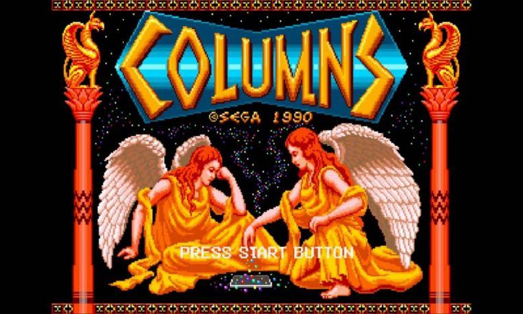

# Columns_2.0

This game is the re-creation of the 1990 Sega game Columns. This project was written in Python and utilizes the Pygame library. Pygame helps to incorporate graphics, sound, and input.

Music: https://www.youtube.com/watch?v=zjFaiyYqk4w
Sound Effects: https://www.youtube.com/watch?v=yVu6BxTVEf8

Demo: https://youtu.be/7vWDv8J4_zs
